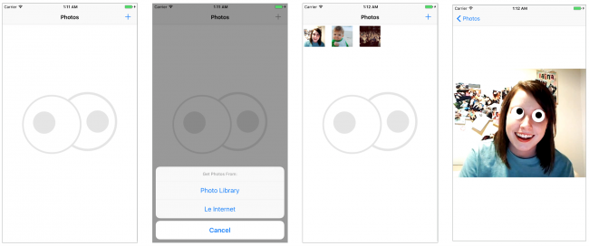
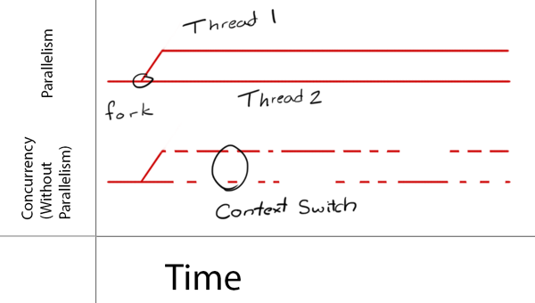
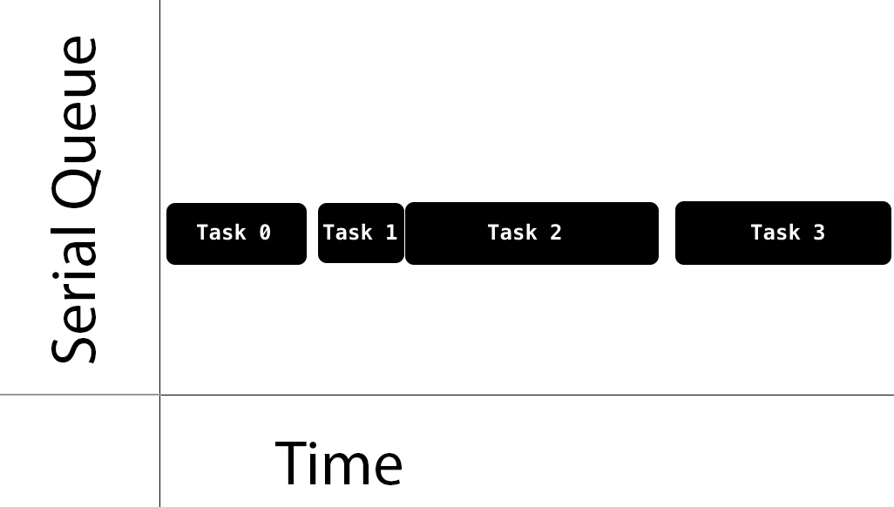
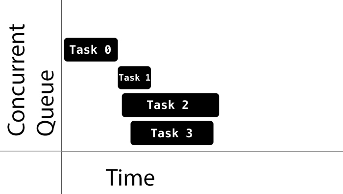
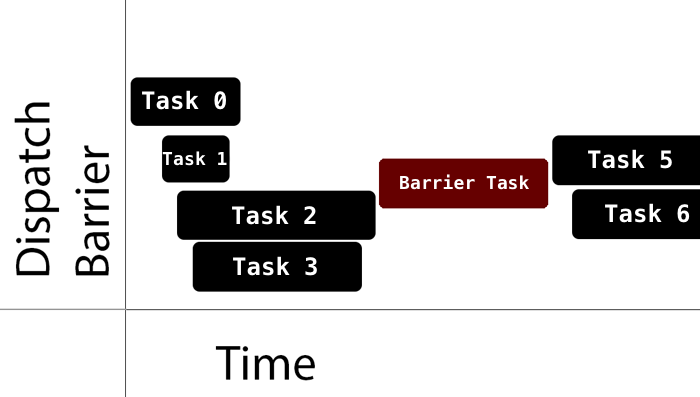
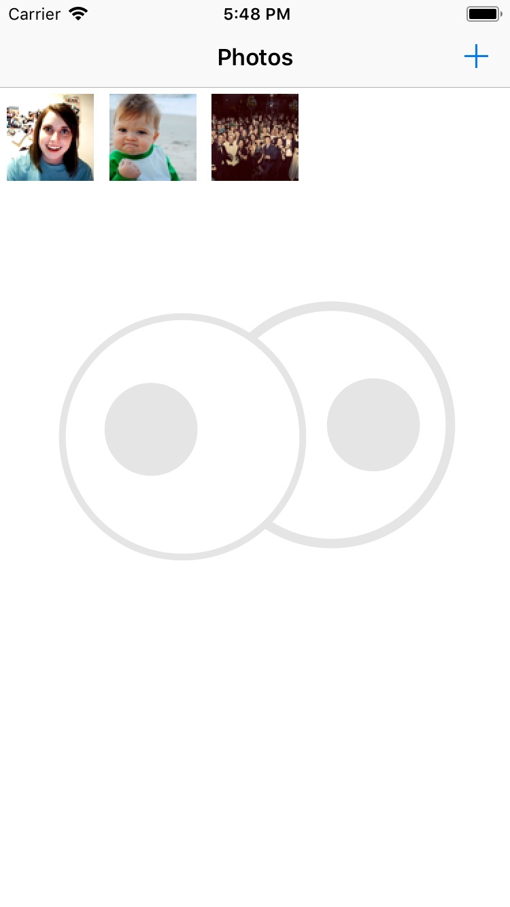

在这个关于中央调度的Swift 4教程的第一部分中，学习所有关于多线程、调度队列和并发性的知识。

> 作者: Evan Dekhayser [原文链接](https://www.raywenderlich.com/5370-grand-central-dispatch-tutorial-for-swift-4-part-1-2)
> Version: Swift 4.2, iOS 12, Xcode 10

- **更新说明**:Evan Dekhayser 将本教程更新为 Swift 4.2。克里斯汀·艾伯纳西写了原著。

Grand Central Dispatch (GCD) 是一套用于管理并发操作的底层API。它可以通过将计算成本高昂的任务推迟到后台来帮助提高你的应用响应能力。与锁和线程相比, 它是一种更容易使用的并发模型。与锁和线程相比, 它是一种更容易使用的并发模型。

这两部分 Grand Central Dispatch 教程中，你将学习 GCD 和它的 Swift API 的来龙去脉。第一部分将解释 GCD 的作用，并且展示几个 GCD 的基本功能。在第二部分，你将学习一些 GCD 提供的高级功能。

你将在现有的基础上构建一个名为 **GooglyPuff** 应用。GooglyPuff 是一款未经优化的“线程不安全”应用程序，它使用 Core Image 的人脸检测 API 将金鱼眼覆盖在检测到的人脸上。你可以从照片库中选择图像来接收此效果，也可以选择从 internet 上下载的图像。

在本教程中，如果你选择接受它，那么你的任务就是使用 GCD 来优化应用程序，并确保可以安全地从不同线程调用代码。

## 开始

下载[本教程项目](https://koenig-media.raywenderlich.com/uploads/2018/08/GooglyPuff_Swift4_Materials_Part1-1.zip)。在 Xcode 中打开它并运行它，看看需要处理什么。

主屏幕最初是空的。点击 **+**，然后选择 **Le Internet** 从 Internet 上下载预定义的图像。点击第一张图片，你会看到瞪视的眼睛添加到脸上。




在本教程中，你将主要使用四个类:

- `PhotoCollectionViewController`: 初始视图控制器。它以缩略图的形式显示选中的照片。
- `PhotoDetailViewController`: 显示从`PhotoCollectionViewController`中选择的照片，并将瞪视的眼睛添加到图像中。
- `Photo`: 此协议描述照片的属性。它提供了一个图像、一个缩略图及其相应的状态。该项目包括两个实现该协议的类: `DownloadPhoto`，它从 `URL` 实例化一张照片;`AssetPhoto`，它从`PHAsset`实例化一张照片。
- `PhotoManager`: 管理所有的照片对象。

这款应用程序存在一些问题。在运行这款应用程序时，你可能已经注意到，下载完成警告还为时过早。你将在本系列的第二部分中解决这个问题。

在第一部分中，你将进行一些改进，包括优化添加瞪视的眼睛的过程和使 `PhotoManager` 线程安全。

## GCD 概念

要理解 GCD，你需要熟悉与并发和线程相关的几个概念。

### Concurrency 并发性

在 iOS 中，进程或应用程序由一个或多个线程组成。操作系统调度程序独立地管理线程。每个线程都可以并发执行，但是这取决于系统来决定是否发生，何时发生，以及如何发生。

单核设备通过一种称为**时间分割**的方法实现并发。它们运行一个线程，执行一个上下文切换，然后运行另一个线程。



另一方面，多核设备通过并行性同时执行多个线程。

GCD 构建在线程之上。在底层，它管理一个共享线程池。使用 GCD，你可以添加代码块或工作项来**dispatch queues**，GCD 决定在哪个线程上执行它们。

在构建代码时，你将发现可以同时运行的代码块，以及不应该同时运行的代码块。这样就可以使用GCD来利用并发执行。

注意，GCD 根据系统和可用的系统资源决定需要多少并行性。需要注意的是，并行性需要并发性，但并发性并不保证并行性。

基本上，并发是关于结构的，而并行是关于执行的。

## Queues 队列

如上所述，GCD 通过一个名为 `DispatchQueue` 的类对调度队列进行操作。你向这个队列提交工作单元，GCD将按照 FIFO 顺序(先入先出)执行它们，确保提交的第一个任务是第一个启动的任务。

Dispatch queues 是**线程安全**的，这意味着你可以同时从多个线程访问它们。当你了解分派队列如何为你自己的代码部分提供线程安全时，GCD 的好处就显而易见了。关键是选择正确的调度队列类型和正确的调度函数，将你的工作提交到队列中。

队列可以是 **串行(serial)** 的，也可以是 **并发(concurrent)** 的。串行队列保证在任何给定时间只运行一个任务。GCD 控制执行时间。你不会知道从一个任务结束到下一个任务开始之间的时间:




并发队列允许多个任务同时运行。队列保证任务按照添加的顺序启动。任务可以按任意顺序完成，你不知道下一个任务启动所需的时间，也不知道在任何给定时间运行的任务的数量。

这是设计上的:你的代码不应该依赖于这些实现细节。

参见下面的示例任务执行:




注意任务1、任务2和任务3是如何一个接一个快速启动的。另一方面，Task 1 在 Task 0 之后需要一段时间才能启动。还要注意，虽然 Task 3 在 Task 2 之后启动，但它首先完成。

何时开始一项任务完全取决于 GCD。如果一个任务的执行时间与另一个任务的执行时间重叠，则由 GCD 决定是应该在不同的核心上运行，还是在可用的核心上运行，或者执行上下文切换来运行不同的任务。

GCD 提供三种主要类型的队列:

1. **主队列**:在主线程上运行，是一个串行队列。
2. **全局队列**:由整个系统共享的并发队列。有四种具有不同优先级的队列:high、default、low 和background。后台优先级队列的优先级最低，并在任何I/O活动中进行节流，以最小化对系统的负面影响。
3. **自定义队列**:创建的队列可以是串行的，也可以是并发的。这些队列中的请求实际上以全局队列中的一个结束。

将任务发送到全局并发队列时，不直接指定优先级。相反，你可以指定服务质量( QoS )类属性。这表明了任务的重要性，并指导 GCD 确定任务的优先级。

QoS 类包括:

1. **用户交互**: 这表示为了提供良好的用户体验，必须立即完成的任务。将其用于UI更新、事件处理和需要低延迟的小型工作负载。这个类在应用程序执行过程中所做的工作总量应该很小。这应该在主线程上运行。
2. **用户发起的**: 用户从UI发起这些异步任务。当用户在等待即时结果和继续用户交互所需的任务时使用它们。它们在高优先级全局队列中执行。
3. **实用程序**: 这表示长时间运行的任务，通常带有用户可见的进度指示器。将其用于计算、I/O、联网、连续数据输入和类似的任务。这个班的设计是节能的。这将映射到低优先级全局队列。
4. **后台**: 这表示用户不直接知道的任务。将其用于预取、维护和其他不需要用户交互且对时间不敏感的任务。这将映射到后台优先级全局队列。

## 同步与异步

使用 GCD，你可以同步或异步地分派任务。

同步函数在任务完成后将控制权返回给调用者。你可以通过调用 `DispatchQueue.sync(execute:)` 来同步调度一个工作单元。

异步函数立即返回，命令任务启动，但不等待任务完成。因此，异步函数不会阻止当前执行线程继续执行下一个函数。你可以通过调用 `DispatchQueue.async(execute:)` 来异步地调度一个工作单元。

## 管理任务

到现在为止，你已经听过很多任务了。在本教程中，你可以将任务视为[闭包](https://docs.swift.org/swift-book/LanguageGuide/Closures.html)。闭包是自包含的、可调用的代码块，可以存储和传递。

你提交给 `DispatchQueue` 的每个任务都是 `DispatchWorkItem`。你可以配置 `DispatchWorkItem` 的行为，比如它的QoS类，或者是否生成一个新的分离线程。

## 处理后台任务

有了所有这些 GCD 知识准备，是时候为你的第一个应用程序改进了!

回到应用程序，从照片库中添加一些照片，或者使用 **Le Internet** 选项下载一些照片。点击照片。注意照片细节视图显示的时间。在速度较慢的设备上观看大型图像时，这种延迟更为明显。

重载视图控制器的 `viewDidLoad()` 很容易，导致在视图出现之前等待很长时间。如果在加载时工作不是绝对必要的，那么最好将其转变到后台运行。

这听起来像是 `DispatchQueue` 的异步作业!

打开 **PhotoDetailViewController.swift**。修改 `viewDidLoad()` 并替换这两行:

```swift
let overlayImage = faceOverlayImageFrom(image)
fadeInNewImage(overlayImage)
```

代码如下:

```swift
// 1
DispatchQueue.global(qos: .userInitiated).async { [weak self] in
  guard let self = self else {
    return
  }
  let overlayImage = self.faceOverlayImageFrom(self.image)

  // 2
  DispatchQueue.main.async { [weak self] in
    // 3
    self?.fadeInNewImage(overlayImage)
  }
}
```

下面是代码一步一步做的事情:

1. 将工作移动到后台全局队列，并在闭包中异步运行工作。这使得 `viewDidLoad()` 在主线程上更早地完成，并使加载感觉更快捷。同时，人脸检测处理也开始了，并将在晚些时候完成。
2. 此时，人脸检测处理已经完成，你已经生成了一个新图像。因为你想使用这个新图像来更新你的 `UIImageView`，你添加一个新的闭包到主队列。记住——任何修改UI的东西都必须在主线程上运行!
3. 最后，使用 `fadeInNewImage(_:) `更新 UI，它执行新的瞪视的眼睛图像的淡入过渡。

在两个点中，添加 `[weak self]` 以捕获每个闭包中对 `self` 的弱引用。如果你不熟悉捕获列表，请参阅本教程中的[内存管理](https://www.raywenderlich.com/959-arc-and-memory-management-in-swift)。

构建并运行该应用程序。通过 **Le Internet** 选项下载照片。选择一张照片，你会注意到视图控制器加载速度明显加快，并在短时间延迟后添加瞪视的眼睛:


当瞪视的眼睛出现时，这给应用程序带来了很好的前后效果。即使你试图加载一个巨大的图像，你的应用也不会在视图控制器加载时挂起。      

通常，当你需要在后台执行基于网络或 CPU 密集型任务而不是阻塞当前线程时，你需要使用 `async`。

这里有一个关于如何以及何时使用 `async` 的各种队列的快速指南:

- **主队列**: 这是在完成并发队列上的任务后更新 UI 的常见选择。为此，需要在另一个闭包中编写一个闭包。以主队列为目标并调用 `async` 可以确保这个新任务在当前方法完成后的某个时间执行。

- **全局队列**: 这是在后台执行非 UI 工作的常见选择。

- **自定义串行队列**: 当你想串行执行后台工作并跟踪它时，这是一个很好的选择。这消除了资源争用和竞争条件，因为你知道一次只执行一个任务。注意，如果需要方法中的数据，必须声明另一个闭包来检索它，或者考虑使用 `sync`。

## 延迟任务执行

`DispatchQueue` 允许延迟任务执行。不要用它来解决竞态条件或其他计时错误，比如引入延迟。相反，当你希望任务在特定时间运行时，可以使用此方法。

考虑一下你的应用程序的用户体验。当用户第一次打开应用程序时，他们可能不知道该做什么——你是吗?:]

如果没有照片，最好给用户显示一个提示。你还应该考虑用户的眼睛将如何导航主屏幕。如果你过快地显示一个提示，他们可能会错过它，因为他们的眼睛停留在视图的其他部分。两秒钟的延迟应该足以吸引用户的注意力并引导他们。

打开 **PhotoCollectionViewController.swift** 并填写 `showOrHideNavPrompt()` 实现:

```swift
// 1
let delayInSeconds = 2.0

// 2
DispatchQueue.main.asyncAfter(deadline: .now() + delayInSeconds) { [weak self] in
  guard let self = self else {
    return
  }

  if PhotoManager.shared.photos.count > 0 {
    self.navigationItem.prompt = nil
  } else {
    self.navigationItem.prompt = "Add photos with faces to Googlyify them!"
  }

  // 3
  self.navigationController?.viewIfLoaded?.setNeedsLayout()
}
```

这是上面发生的事情:

1. 指定要延迟的时间量。
2. 然后等待指定的时间，然后异步运行更新照片计数和更新提示符的块。
3. 在设置提示符后，强制导航栏显示，以确保它看起来是正确的。

`showOrHideNavPrompt()` 在 `viewDidLoad()` 中执行，并且在任何时候重载 `UICollectionView`。

构建并运行应用程序。在你看到提示之前，应该会有一点延迟:


>注意:你可以忽略 Xcode 控制台中的自动布局消息。它们都来自 iOS，不会显示你的错误。

为什么不用定时器呢?如果你有重复的任务，那么可以考虑使用它，这些任务更容易使用计时器进行调度。以下是坚持使用分派队列的 `asyncAfter()` 的两个原因。

一个是可读性。要使用定时器，你必须定义一个方法，然后使用一个选择器或已定义方法的调用来创建定时器。使用 `DispatchQueue` 和 `asyncAfter()` ，只需添加一个闭包。

计时器是在运行循环上调度的，因此你还必须确保将其调度在正确的运行循环上(在某些情况下，还需要调度正确的运行循环模式)。在这方面，使用分派队列更容易。

## 管理单例

单例。不管你喜欢还是讨厌它们，它们在 iOS 中的受欢迎程度不亚于网络上的猫照片。:]

单例的一个常见问题是它们通常不是线程安全的。考虑到单例的使用，这种担心是合理的:单例通常由多个控制器同时访问单例实例来使用。你的 PhotoManager 类是一个单例类，因此需要考虑这个问题。

可以从多个线程或并发任务安全地调用线程安全代码，而不会导致任何问题，如数据损坏或应用程序崩溃。非线程安全的代码一次只能在一个上下文中运行。

有两种线程安全情况需要考虑:在单例实例初始化期间和在对实例的读写期间。

由于 Swift 初始化静态变量的方式，初始化变得很简单。它在第一次访问静态变量时初始化它们，并保证初始化是原子的。也就是说，Swift 将执行初始化的代码视为一个关键部分，并确保它在任何其他线程访问静态变量之前完成。

临界段是一段不能同时执行的代码，也就是说，不能同时从两个线程执行。这通常是因为代码操作共享资源，比如一个变量，如果被并发进程访问，该变量可能会损坏。

打开 **PhotoManager.swift**。快速查看你如何初始化单例:

```swift
class PhotoManager {
  private init() {}
  static let shared = PhotoManager()
}
```

私有初始化器确保只有一个 `PhotoManager` 被分配给 `shared` 。这样，你就不必担心在不同的管理器之间同步对照片存储的更改。

在访问处理共享内部数据的单例中的代码时，仍然需要处理线程安全问题。你可以通过同步数据访问等方法来处理此问题。在下一节中你将看到一种方法。

## 处理读写问题

在Swift中，任何使用 `let` 关键字声明的变量都是常量，因此是只读的和线程安全的。但是，使用 `var` 关键字声明变量，它就会变得可变，并且不是线程安全的，除非数据类型被设计成这样。数组和字典等 Swift 集合类型在声明为可变时不是线程安全的。

尽管许多线程可以毫无问题地同时读取数组的可变实例，但是让一个线程在另一个线程读取数组时修改它是不安全的。单例并不会阻止这种情况在当前状态下发生。

要了解问题，请查看 **PhotoManager.swift** 中的 `addPhoto(_:)` ，转载如下:

```swift
func addPhoto(_ photo: Photo) {
  unsafePhotos.append(photo)
  DispatchQueue.main.async { [weak self] in
    self?.postContentAddedNotification()
  }
}
```

这是一个 **write** 方法，用于修改可变数组对象。

现在看看照片的属性，复制如下:

```swift
private var unsafePhotos: [Photo] = []
  
var photos: [Photo] {
  return unsafePhotos
}
```

这个属性的 getter 被称为 **read** 方法，因为它读取可变数组。调用者获取数组的副本，并受到保护，防止不适当地对原始数组进行突变。但是，这并不能防止一个线程调用 write 方法 `addPhoto(_:)`，同时另一个线程调用 `photos` 属性的 getter。

这就是为什么支持变量被命名为 `unsafePhotos` ——如果它在错误的线程上被访问，你可能会得到一些奇怪的行为!

> 注意:在上面的代码中，调用者为什么获得照片数组的副本?在 Swift 中，参数和函数的返回类型要么通过引用传递，要么通过值传递。
通过值传递会产生对象的副本，对副本的更改不会影响原始副本。Swift 默认情况下，类实例通过引用传递，结构体通过值传递。Swift 内置的数据类型，如数组和字典，是作为结构体实现的。

> 在来回传递集合时，代码中可能会出现大量复制。不要担心这对内存使用的影响。Swift 集合类型经过优化，只在必要时复制，例如，当你的应用程序第一次修改通过值传递的数组时。

这是典型的软件开发[读写问题](https://en.wikipedia.org/wiki/Readers%E2%80%93writers_problem)。GCD 提供了使用 **dispatch barriers** 创建[读/写锁](https://en.wikipedia.org/wiki/Readers%E2%80%93writer_lock)的优雅解决方案。调度屏障是一组函数，它们在处理并发队列时充当串行风格的瓶颈。

当你将 `DispatchWorkItem` 提交到分派队列时，你可以设置标志来指示它应该是该特定时间在指定队列上执行的唯一项。这意味着在分派屏障之前提交到队列的所有项必须在 `DispatchWorkItem` 执行之前完成。

当轮到 `DispatchWorkItem` 时，barrier 执行它，并确保队列在此期间不执行任何其他任务。一旦完成，队列返回到它的默认实现。

下图说明了屏障对各种异步任务的影响:




请注意，在正常操作中，队列的行为就像一个正常的并发队列。但是当 barrier 执行时，它实际上就像一个串行队列。也就是说，势垒是唯一执行的东西。屏障完成后，队列恢复为正常的并发队列。

在全局后台并发队列中使用屏障时要小心，因为这些队列是共享资源。在自定义串行队列中使用屏障是多余的，因为它已经串行执行。在自定义并发队列中使用屏障对于处理原子或关键代码区域中的线程安全是一个很好的选择。

你将使用自定义并发队列来处理 barrier 函数，并将读写函数分开。并发队列将允许同时执行多个读取操作。

打开 **PhotoManager.swift** 并在 `unsafePhotos` 声明的上方添加一个私有属性:

```swift
private let concurrentPhotoQueue =
  DispatchQueue(
    label: "com.raywenderlich.GooglyPuff.photoQueue",
    attributes: .concurrent)
```

这将 `concurrentPhotoQueue` 初始化为一个并发队列。使用描述性名称设置 label，这在调试过程中很有用。通常，你使用反向 DNS 风格的命名约定。

接下来，用以下代码替换 `addPhoto(_:)`:

```swift
func addPhoto(_ photo: Photo) {
  concurrentPhotoQueue.async(flags: .barrier) { [weak self] in
    // 1
    guard let self = self else {
      return
    }

    // 2
    self.unsafePhotos.append(photo)

    // 3
    DispatchQueue.main.async { [weak self] in
      self?.postContentAddedNotification()
    }
  }
}
```

下面是你的新写方法的工作原理:

1. 使用屏障异步分派写操作。当它执行时，它将是队列中惟一的项。
2. 将对象添加到数组中。
3. 最后，你发布一个通知说你已经添加了照片。你必须在主线程上发布此通知，因为它将执行UI工作。因此，将另一个任务异步分派到主队列以触发通知。

这样就完成了写操作，但是还需要实现 `photos` 读取方法。

为了确保写操作的线程安全，需要对 `concurrentPhotoQueue` 队列执行读操作。你需要从函数调用中返回数据，这样异步分派就不会中断它。在这种情况下，`sync` 是一个很好的选择。

使用 `sync` 跟踪带有分派屏障的工作，或者在需要等待操作完成之后才能使用闭包处理的数据。

不过你要小心。想象一下，如果你调用 `sync` 并以当前正在运行的队列为目标。这将导致 **死锁** 的情况。

两个(有时更多)项——在大多数情况下是线程——如果它们都在等待对方完成或执行另一个操作时陷入死锁。第一个完成不了，因为它在等待第二个完成。但是第二个不能完成，因为它在等待第一个完成。

在你的例子中，同步调用将等待闭包完成，但是闭包不能完成(或开始!)，直到当前执行的闭包完成，而它不能!这将迫使你注意从哪个队列调用—以及传入哪个队列。

下面是使用同步的时间和地点的简要概述:

- **主队列**: 请非常小心，原因与上面相同;这种情况还可能导致死锁。这在主队列上尤其糟糕，因为整个应用程序将变得无响应。

- **全局队列**: 这是一个很好的选择，可以通过调度屏障同步工作，或者在等待任务完成时同步工作，以便执行进一步的处理。

- **定制串行队列**: 在这种情况下要非常小心;如果你在队列中运行，并针对相同的队列调用 `sync`，那么肯定会创建死锁。

依然在 **PhotoManager.swift** 修改 `photos` 属性 getter:

```swift
var photos: [Photo] {
  var photosCopy: [Photo]!

  // 1
  concurrentPhotoQueue.sync {

    // 2
    photosCopy = self.unsafePhotos
  }
  return photosCopy
}
```

这是一步一步来的:

1. 同步分派到 `concurrentPhotoQueue` 以执行读取。
2. 将照片阵列的副本存储在 `photosCopy` 中并返回。

构建并运行该应用程序。通过 **Le Internet** 选项下载照片。它应该像以前那样工作，但是在底层，你有一些非常愉快的线程。




恭喜-你的 `PhotoManager` 单例现在是线程安全的!无论你在哪里，如何读或写照片，你都可以确信它将以一种安全的方式发生，不会有任何意外。

## 从这里去哪里?

在这个重要的中央调度教程中，你学习了如何使代码线程安全，以及如何在执行CPU密集型任务时维护主线程的响应能力。

下载[本教程项目](https://koenig-media.raywenderlich.com/uploads/2018/08/GooglyPuff_Swift4_Materials_Part1-1.zip)。它包含本教程到目前为止所做的所有改进。在本教程的第二部分中，你将继续改进这个项目。

如果你打算优化自己的应用程序，你真的应该用 Xcode 内置的**时间分析器(Time Profiler)**来分析你的工作。使用这个工具超出了本教程的范围，所以请查看[如何使用Instruments](https://www.raywenderlich.com/397-instruments-tutorial-with-swift-getting-started)来获得一个优秀的概述。

你可能还想看看[Rob Pike关于并行vs平行的精彩演讲](https://vimeo.com/49718712)。

我们的 iOS 与 GCD 的并发性和操作视频教程系列也涵盖了很多我们在本教程中讨论的相同主题。

在本教程的下一部分中，你将更深入地研究 GCD 的 API，以完成更酷的工作。

如果你有任何问题或意见，欢迎加入下面的讨论!